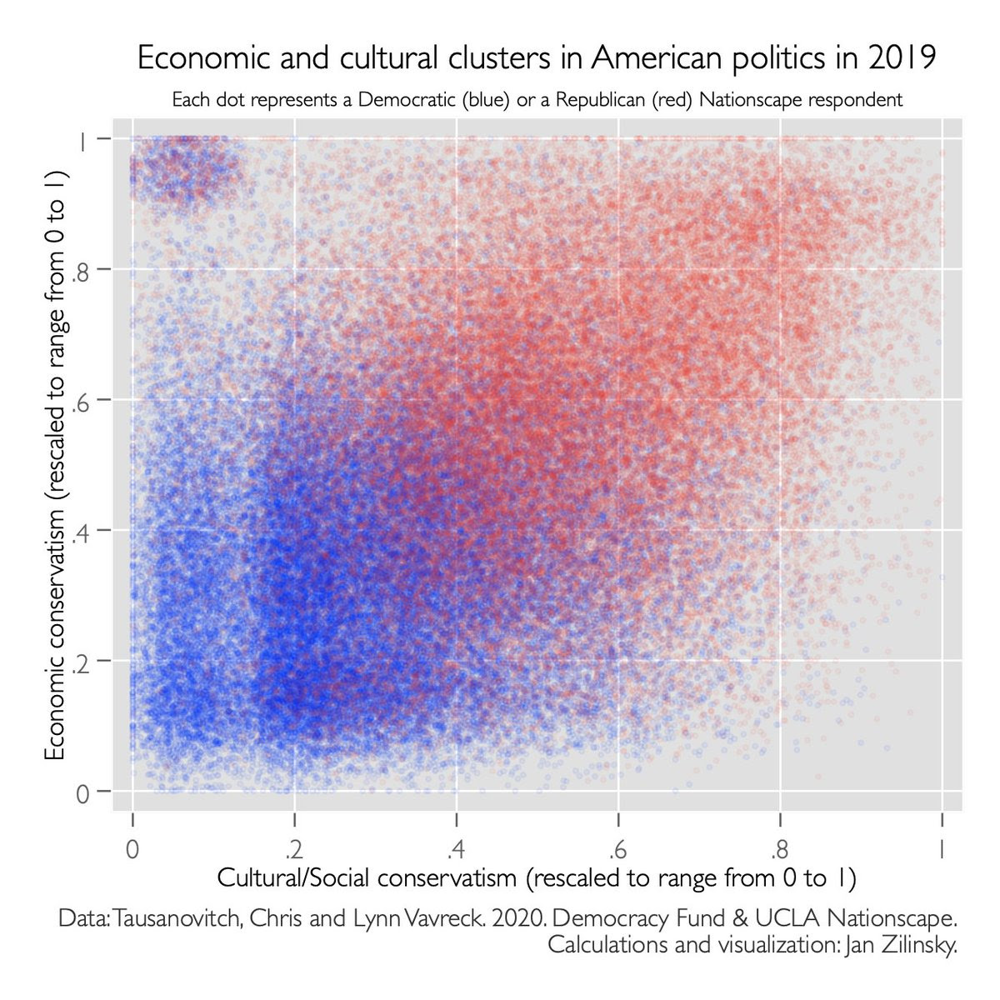

# Ideal points, ideological cleavages, and other quantities 

To better understand perceived and actual axes of political conflict, it is useful to know on which issues Americans agree and disagree.

It is also useful to estimate where people stand over time, because only some positions are deeply held. Other issues emerge when they are strategically activated, tied to existing values in the electorate, or simply because the world is changing. 

In early 2020, I used the first release of the Nationscape dataset to place U.S. respondents on two dimensions, and make this chart:

## Nationscape

Below I list the variable names and descriptions. The culatural/social and economic views were converted into scales with an IRT-2PL model. 

### Cultural and social issues

| Attitude/Opinion                                             | coding                 |
|--------------------------------------------------------------|------------------------|
| Don't permit late term abortion                              | late_term_abortion==2  |
| Never permit abortion                                        | abortion_never==1      |
| Against abortion when woman's life is in danger              | abortion_conditions==2 |
| Against background checks for gun purchases                  | guns_bg==2             |
| Against banning all guns                                     | ban_guns==2            |
| Against an assault rifle ban                                 | ban_assault_rifles==2  |
| Against a limit gun magazines                                | limit_magazines==2     |
| Require a waiting period and ultrasound before an abortion   | abortion_waiting==1    |
| Don't permit abortion at any time                            | abortion_any_time==2   |
| Against a public gun registry                                | gun_registry==2        |
| Allow employers to decline coverage of abortions             | abortion_insurance==1  |
| Allow Ten Commandments displays in public schools            | ten_commandments==1    |
| Against allowing transgender people to serve in the military | trans_military==2      |
| Supports tax-funded vouchers for religious schools           | vouchers==1            |

### Economic issues

| Attitude/Opinion                                          | coding                    |
|-----------------------------------------------------------|---------------------------|
| Provide government-run health insurance to all Americans  | gov_insurance==1          |
| Provide government health insurance option                | public_option==1          |
| Subsidize health insurance for low income Americans       | health_subsidies==1       |
| Abolish private health insurance                          | abolish_priv_insurance==1 |
| Raise taxes on families making over $600,000              | raise_upper_tax==1        |
| Cut taxes for families making less than $100,000 per year | mctaxes==1                |
| Against eliminating the estate tax                        | estate_tax==2             |
| Provide debt-free state college                           | college==1                |
| Cap carbon emissions to combat climate change             | cap_carbon==1             |
| Invest in technology to protect the environment           | green_tech==1             |
| Guarantee jobs for all Americans                          | guaranteed_jobs==1        |
| Enact a Green New Deal                                    | green_new_deal==1         |
| Provide 12-week maternity leave                           | maternityleave==1         |
| Enact Medicare-for-All                                    | medicare_for_all==1       |
| Raise the minimum wage to $15/hour                        | minwage==1                |
| Against removing oil and gas drilling barriers            | oil_and_gas==2            |
| Grant reparations payments to descendants of slaves       | reparations==1            |
| Against right-to-work laws                                | right_to_work==2          |
| Limit trade with other countries                          | trade==1                  |
| Raise taxes on families making over $250,000              | uctaxes2==1               |
| Impose trade tariffs on Chinese goods                     | china_tariffs==1          |

### Immigration

An immigration scale (not shown in the figure above) was calculated separately.

The available variables are listed here to help anyone interested using the data:

| Attitude/Opinion                                                                                    | coding                    |
|-----------------------------------------------------------------------------------------------------|---------------------------|
| Against a path to citizenship for undocumented immigrants brought here as children                  | dreamers==2               |
| Against a path to citizenship for all undocumented immigrants                                       | path_to_citizenship==2    |
| Build a wall on the southern U.S. border                                                            | wall==1                   |
| Deport all undocumented immigrants                                                                  | deportation==1            |
| Separate children from their parents when parents can be prosecuted for illegal entry into the U.S. | immigration_separation==1 |
| Shift from a family-based to a merit-based immigration system                                       | immigration_system==1     |
| Require proof of legal residence to wire money                                                      | immigration_wire==1       |
| Ban entry from Muslim countries                                                                     | muslimban==1              |
| Against government insurance for immigrants                                                         | immigration_insurance==2  |
| Charge immigrants who entered illegally with a crime                                                | criminal_immigration==1   |

### Issued not used for analysis

There were also 2 questions about the militrary, and a question on drug legalization, that were not included in the scales that I calculated.

Additionally, the following questions about support COVID-related policies were also excluded in the second release of the Nationscape data:

- Increase spending on unemployment insurance
- Increase spending on health insurance and food aid for the poor
- Require employers to provide additional leave if an employee is quarantined or has to care for a family member with the coronavirus
- Reduce interest rates
- Send individual Americans a cash payment
- Provide financial support for the airline industry
- Provide financial support for local businesses
